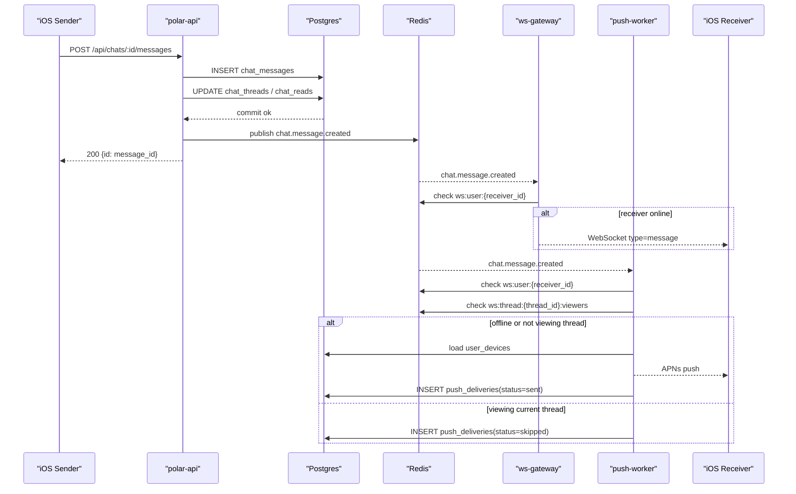
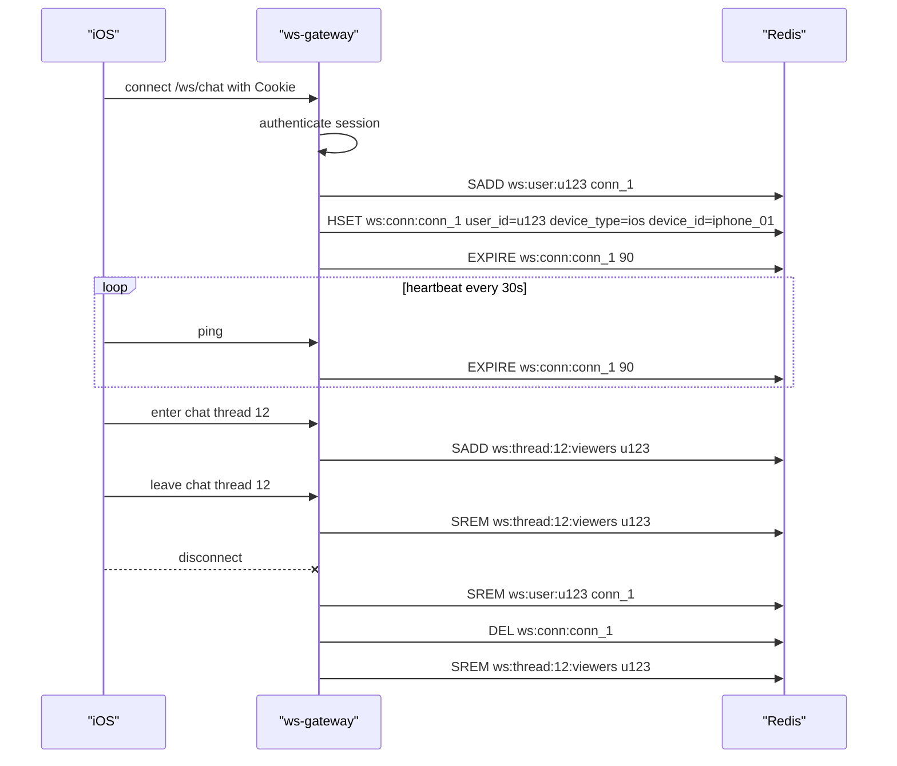

# 私聊系统设计与 API（给 iOS 接入）

本文整理私聊的核心设计、数据模型、HTTP API、WebSocket 事件，以及示例，方便 iOS 端快速对接。

补充说明：

- 用户级 `LLM Config`、`Bot User`、`llm_thread`、`shared_markdown` 与 Retry 的重构说明，见 [doc/llm-bot.md](/Users/apple/github/Polar-/doc/llm-bot.md)

## 设计概览
- 私聊是双人会话（thread）+ 消息（message）模型。
- 会话通过两位用户 ID 生成唯一对话。
- 未读数通过最后已读时间与消息时间计算。
- WebSocket 负责实时推送，HTTP 作为兜底。
- 支持用户级拉黑（block）；拉黑后历史消息仍可查看，但不能继续创建私聊或发送新消息。

## 数据模型（服务端）
chat_threads 字段：
- `id` BIGSERIAL
- `user_low` TEXT
- `user_high` TEXT
- `created_at` TIMESTAMPTZ
- `last_message` TEXT
- `last_message_at` TIMESTAMPTZ

chat_messages 字段：
- `id` BIGSERIAL
- `thread_id` BIGINT
- `sender_id` TEXT
- `content` TEXT
- `created_at` TIMESTAMPTZ
- `deleted_at` TIMESTAMPTZ (可空)
- `deleted_by` TEXT (可空)

chat_reads 字段：
- `thread_id` BIGINT
- `user_id` TEXT
- `last_read_at` TIMESTAMPTZ

user_blocks 字段：
- `blocker_user_id` TEXT
- `blocked_user_id` TEXT
- `created_at` TIMESTAMPTZ

## 拉黑规则
- 拉黑是用户与用户之间的单向关系，由 `user_blocks` 维护。
- 如果 A 拉黑 B：
  - A 与 B 之间已有的历史私聊消息仍然保留，可继续读取。
  - A 不能再主动创建与 B 的新私聊入口。
  - B 也不能再主动创建与 A 的新私聊入口。
  - A 与 B 在已有私聊里都不能继续发送新消息。
- `system` / bot 会话不受此规则影响。
- 客户端进入历史会话后，应根据服务端返回的 `blocked` / `block_message` 禁用输入框，而不是只在发送时报错。

## 认证方式
- 使用登录后 `SessionCookieName`（HTTP Cookie）认证。
- iOS 端需保存并回传 Cookie。

## HTTP API

### 1. 会话列表
`GET /api/chats?limit=20&offset=0`

返回字段
- `chats`: 会话数组
- `has_more`, `next_offset`

示例响应
```json
{
  "chats": [
    {
      "id": 12,
      "other_user_id": "abc123",
      "other_username": "Alice",
      "last_message": "在吗？",
      "last_message_at": "2026-03-19T09:15:00+08:00",
      "created_at": "2026-03-19T09:00:00+08:00",
      "unread_count": 2
    }
  ],
  "has_more": false,
  "next_offset": 1
}
```

### 2. 创建/获取会话
`POST /api/chats/start`

请求
```json
{ "user_id": "abc123" }
```

响应
```json
{
  "chat": {
    "id": 12,
    "other_user_id": "abc123",
    "other_username": "Alice",
    "last_message": "",
    "last_message_at": null,
    "created_at": "2026-03-19T09:00:00+08:00",
    "unread_count": 0
  }
}
```

如果双方存在拉黑关系，返回 `403 Forbidden`：
```json
{
  "error": "你已拉黑对方，无法创建私聊"
}
```

或：
```json
{
  "error": "对方已拉黑你，无法创建私聊"
}
```

### 3. 获取消息列表（并自动标记已读）
`GET /api/chats/:id/messages?limit=50&offset=0`

响应
```json
{
  "messages": [
    {
      "id": 88,
      "thread_id": 12,
      "sender_id": "me123",
      "sender_username": "Me",
      "content": "你好",
      "created_at": "2026-03-19T09:10:00+08:00",
      "deleted": false
    },
    {
      "id": 89,
      "thread_id": 12,
      "sender_id": "abc123",
      "sender_username": "Alice",
      "content": "消息已撤回",
      "created_at": "2026-03-19T09:11:00+08:00",
      "deleted": true,
      "deleted_at": "2026-03-19T09:12:00+08:00",
      "deleted_by": "abc123"
    }
  ],
  "blocked": false,
  "block_message": "",
  "has_more": false,
  "next_offset": 2
}
```

字段补充：
- `blocked`：当前会话是否因拉黑而禁止继续发送
- `block_message`：对应的提示文案；若为空，表示当前会话可正常发送

### 4. 发送消息
`POST /api/chats/:id/messages`

发送限制：
- 普通用户与普通用户的私聊，遵循一问一答节奏。
- 如果当前会话最后一条未撤回消息就是你发的，则下一条会被拒绝，需等待对方先回复。
- 如果当前会话任一方存在拉黑关系，则历史仍可见，但发送会被拒绝。
- 对 `system` 和 bot 会话不生效，它们仍可连续发送。

请求
```json
{ "content": "你好" }
```

响应
```json
{ "message": "发送成功", "id": 88 }
```

当违反上述限制时，返回 `403 Forbidden`：
```json
{
  "error": "请等待对方回复后再发送消息",
  "code": "chat reply required"
}
```

当会话因拉黑而不可发送时，返回 `403 Forbidden`：
```json
{
  "error": "你已拉黑对方，无法继续发送消息",
  "code": "chat blocked"
}
```

或：
```json
{
  "error": "对方已拉黑你，无法继续发送消息",
  "code": "chat blocked"
}
```

### 5. 撤回消息
`DELETE /api/chats/:id/messages/:messageId`

响应
```json
{ "message": "已撤回" }
```

## WebSocket 实时推送

### 连接
`GET /ws/chat`（WebSocket 升级）

iOS 端连接时需带 Cookie（Session）。

### 事件结构
所有事件为 JSON：
```json
{
  "type": "message | read | revoke",
  "chat_id": 12,
  "message": { ... },
  "message_id": 88,
  "user_id": "me123",
  "read_at": "2026-03-19T09:12:00+08:00",
  "deleted_at": "2026-03-19T09:12:00+08:00"
}
```

### 事件示例

#### 新消息
```json
{
  "type": "message",
  "chat_id": 12,
  "message": {
    "id": 88,
    "thread_id": 12,
    "sender_id": "me123",
    "sender_username": "Me",
    "content": "你好",
    "created_at": "2026-03-19T09:10:00+08:00"
  }
}
```

#### 已读
```json
{
  "type": "read",
  "chat_id": 12,
  "user_id": "me123",
  "read_at": "2026-03-19T09:12:00+08:00"
}
```

#### 撤回
```json
{
  "type": "revoke",
  "chat_id": 12,
  "message_id": 88,
  "deleted_at": "2026-03-19T09:12:00+08:00"
}
```

## iOS 接入建议
- 先拉会话列表，再进入会话请求消息列表。
- 进入会话后建立 WebSocket 长连，订阅消息与已读事件。
- WS 断开时回退到轮询 `GET /api/chats` 与 `GET /api/chats/:id/messages`。

## iOS Push 架构扩展（推荐实现）

本节补充 iOS Push 的服务端推荐架构。目标是：

- 消息以数据库为准，不依赖 Redis 保存离线消息正文。
- 在线用户优先通过 WebSocket 实时收到消息。
- 离线用户通过 APNs 收到提醒，回到前台后再通过 HTTP/WS 补齐消息。

### 设计原则
- `Postgres` 是消息真相源，负责保存会话、消息、已读、设备信息。
- `Redis` 只负责在线状态、实时事件分发、短期幂等控制。
- `APNs` 只做离线提醒，不作为消息本体通道。
- `iOS` 收到 Push 后不直接信任 Push 内容，应重新拉取会话和消息。

推荐链路：

1. iOS 调用 `POST /api/chats/:id/messages`
2. Polar 服务写入 `chat_messages`
3. 同步更新 `chat_threads`、`chat_reads`
4. 数据库提交成功后，发布 Redis 事件
5. `ws-gateway` 订阅事件并向在线用户推送 WebSocket 消息
6. `push-worker` 订阅同一事件并向离线用户发送 APNs Push

### 推荐服务拆分

`polar-api`
- 提供 HTTP API
- 校验登录态、会话权限
- 写数据库
- 发布内部事件到 Redis

`ws-gateway`
- 提供 `GET /ws/chat`
- 维护用户在线状态与当前浏览会话状态
- 订阅 Redis 事件并向在线连接转发

`push-worker`
- 订阅 Redis 事件
- 判断接收方是否需要 Push
- 查询设备 token 并调用 APNs
- 记录推送结果，便于排查

### 数据模型扩展

现有表可继续保留：

- `chat_threads`
- `chat_messages`
- `chat_reads`

建议补充以下表：

#### 1. user_devices
用于保存设备类型与 Push Token，对应 [api.md](/Users/apple/github/Polar-/doc/api.md) 中已有的 `X-Device-Type` 与 `X-Push-Token`。

字段建议：
- `id` BIGSERIAL PRIMARY KEY
- `user_id` TEXT NOT NULL
- `device_type` TEXT NOT NULL，允许值：`ios`、`android`、`browser`
- `device_id` TEXT，可由客户端生成并持久化，标识某个安装实例
- `push_token` TEXT，可空
- `push_enabled` BOOLEAN NOT NULL DEFAULT TRUE
- `app_version` TEXT，可空
- `last_seen_at` TIMESTAMPTZ
- `last_active_at` TIMESTAMPTZ
- `created_at` TIMESTAMPTZ NOT NULL DEFAULT NOW()
- `updated_at` TIMESTAMPTZ NOT NULL DEFAULT NOW()

约束建议：
- `UNIQUE (user_id, device_type, device_id)`

说明：
- 不建议只按 `user_id + device_type` 唯一，因为同一用户可能有多台 iOS 设备。

#### 2. push_deliveries
用于记录每次 Push 尝试结果，便于排查“为什么用户没收到推送”。

字段建议：
- `id` BIGSERIAL PRIMARY KEY
- `message_id` BIGINT NOT NULL
- `user_id` TEXT NOT NULL，表示接收者
- `device_id` TEXT，可空
- `push_token` TEXT，可空
- `provider` TEXT NOT NULL DEFAULT `apns`
- `status` TEXT NOT NULL，允许值：`pending`、`sent`、`failed`、`skipped`
- `apns_id` TEXT，可空
- `error_message` TEXT，可空
- `created_at` TIMESTAMPTZ NOT NULL DEFAULT NOW()
- `updated_at` TIMESTAMPTZ NOT NULL DEFAULT NOW()

索引建议：
- `INDEX (message_id)`
- `INDEX (user_id, created_at DESC)`

#### 3. chat_member_state
用于记录用户在某个会话上的扩展状态，便于后续支持免打扰、当前会话浏览状态、Push 去重等。

字段建议：
- `thread_id` BIGINT NOT NULL
- `user_id` TEXT NOT NULL
- `mute_until` TIMESTAMPTZ，可空
- `is_muted` BOOLEAN NOT NULL DEFAULT FALSE
- `last_opened_at` TIMESTAMPTZ，可空
- `last_delivered_message_id` BIGINT，可空
- `last_push_message_id` BIGINT，可空
- `created_at` TIMESTAMPTZ NOT NULL DEFAULT NOW()
- `updated_at` TIMESTAMPTZ NOT NULL DEFAULT NOW()

约束建议：
- `PRIMARY KEY (thread_id, user_id)`

### 对现有表的补充建议

#### chat_threads
建议新增：
- `last_message_id` BIGINT

用途：
- 更方便定位会话最后一条消息，减少仅依赖时间字段带来的歧义。

#### chat_reads
建议新增：
- `last_read_message_id` BIGINT

用途：
- 已读状态除时间外再记录最后一条已读消息 ID，后续做未读数、角标、Push 去重会更稳。

### Redis Key 设计

Redis 不保存消息真相，只保存在线态、浏览态和分发事件。

#### 在线连接

`ws:user:{user_id}`
- 类型建议：`SET`
- 值：当前用户所有活跃连接 ID，例如 `conn_a`、`conn_b`

用途：
- 判断某个用户当前是否有在线连接。

`ws:conn:{conn_id}`
- 类型建议：`HASH`
- TTL 建议：`90s`

字段示例：
- `user_id`
- `device_type`
- `device_id`
- `thread_id`
- `last_seen_at`

用途：
- 保存某条 WebSocket 连接对应的用户和设备信息。
- 使用心跳续期，断线后自动过期。

#### 当前浏览会话

`ws:thread:{thread_id}:viewers`
- 类型建议：`SET`
- 值：当前正在查看该会话的用户 ID

用途：
- 判断接收者是否正在浏览当前会话。
- 若用户在线且正在看当前会话，可只走 WebSocket，不发 Push。

#### 事件总线

最小实现可先使用 Redis Pub/Sub：
- `chat.message.created`
- `chat.message.read`
- `chat.message.revoked`

若后续希望增强消费可靠性，可升级为 Redis Stream，例如：
- `stream:chat_events`

内部事件示例：
```json
{
  "event": "chat.message.created",
  "message_id": 88,
  "thread_id": 12,
  "sender_id": "u1",
  "receiver_id": "u2",
  "preview": "你好",
  "created_at": "2026-03-26T20:10:00+08:00"
}
```

说明：
- Redis 内部事件格式建议与对外 WebSocket 事件格式分离。
- 对外 WebSocket 事件面向客户端协议，对内 Redis 事件面向服务消费。

#### 幂等与去重

`push:dedupe:{user_id}:{message_id}`
- 类型建议：普通字符串键
- 值：`1`
- TTL 建议：`24h`

用途：
- 避免 Worker 因重试而对同一条消息重复发送 Push。

### 在线状态维护

建议由 `ws-gateway` 负责维护在线状态：

1. 用户连接 `GET /ws/chat` 并通过 Session 校验
2. 将连接 ID 加入 `ws:user:{user_id}`
3. 写入 `ws:conn:{conn_id}` 并设置 TTL
4. iOS 定时发送心跳，服务端刷新 TTL
5. iOS 进入会话页时，将用户加入 `ws:thread:{thread_id}:viewers`
6. 离开会话页时，将用户移出该 `SET`
7. 连接断开时，清理相关 Redis 状态

说明：
- 在线与否应以 WebSocket 活跃连接为准，而不是只以登录态为准。

### Push 判断规则

`push-worker` 建议按以下顺序判断：

1. 若接收者就是发送者，不推
2. 若接收者没有有效 `push_token`，不推
3. 若 `push:dedupe:{user_id}:{message_id}` 已存在，不重复推
4. 若接收者在线且正在浏览当前 `thread`，不推
5. 若接收者在线但未浏览当前 `thread`，可推
6. 若接收者离线，可推

说明：
- “在线”与“正在当前聊天页”是两个不同概念。
- 用户在线但没有打开该会话时，仍可考虑发送 Push，避免漏提醒。

### 发送消息时序



### 在线状态时序



### API 补充建议

[api.md](/Users/apple/github/Polar-/doc/api.md) 已支持登录/注册时通过请求头上报 `X-Device-Type` 和 `X-Push-Token`。为了更完整支持 Push，建议后续补充以下接口或等价能力。

#### 1. 更新 Push Token
`POST /api/devices/push-token`

请求示例：
```json
{
  "device_id": "iphone_01",
  "device_type": "ios",
  "push_token": "xxxx"
}
```

用途：
- App 启动、Push Token 刷新后重新登记。

#### 2. 清除 Push Token
`DELETE /api/devices/push-token`

请求示例：
```json
{
  "device_id": "iphone_01"
}
```

用途：
- 用户退出登录或关闭 Push 时主动解绑设备。

#### 3. 上报当前正在浏览的会话
建议优先通过 WebSocket 事件上报，而不是单独增加 HTTP 接口。

事件示例：
```json
{ "type": "presence", "action": "view_thread", "thread_id": 12 }
```

```json
{ "type": "presence", "action": "leave_thread", "thread_id": 12 }
```

用途：
- 由 `ws-gateway` 维护 `ws:thread:{thread_id}:viewers`
- 为 Push 判断提供依据

### 实现建议

推荐按以下顺序逐步落地：

1. 增加 `user_devices` 表，完成设备 token 保存
2. 在 `POST /api/chats/:id/messages` 写库成功后发布 Redis 事件
3. 增加 `ws-gateway` 订阅事件并向在线用户转发
4. 在 Redis 中维护 `ws:user:*` 与 `ws:thread:*:viewers`
5. 增加 `push-worker`，向离线或未浏览当前会话的用户发 APNs
6. 增加 `push_deliveries` 用于推送结果追踪

### 小结
- 消息始终先落数据库，不能只存 Redis。
- Redis 负责事件分发和在线状态，不负责保存离线消息真相。
- 在线消息走 WebSocket，离线提醒走 APNs。
- iOS 收到 Push 后，应通过现有聊天 API 和 WebSocket 重新同步消息状态。
